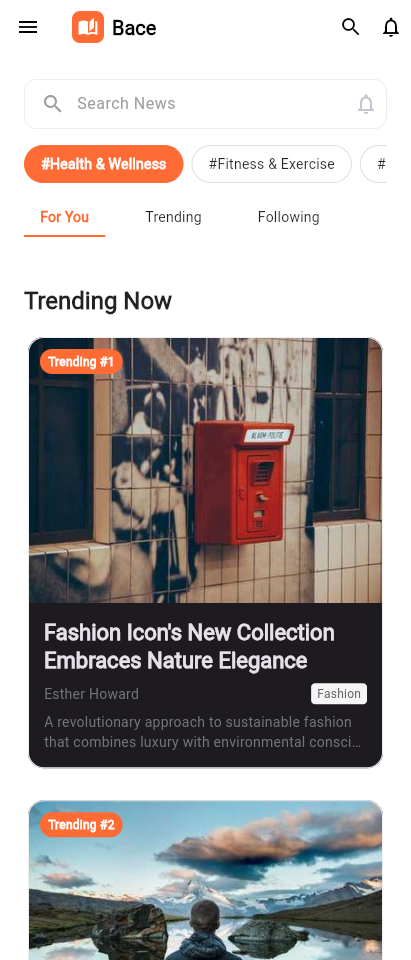
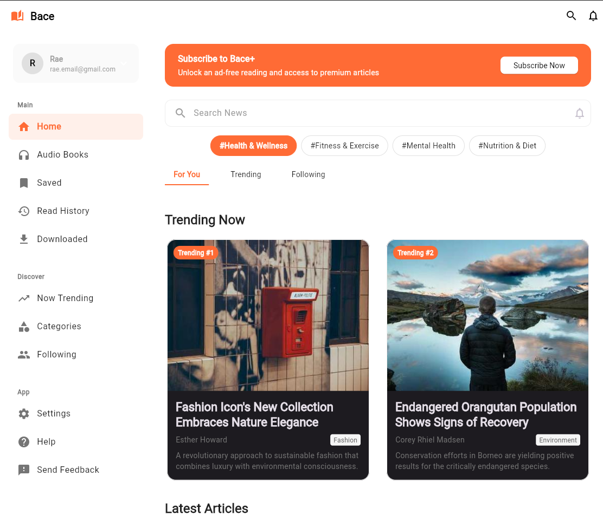
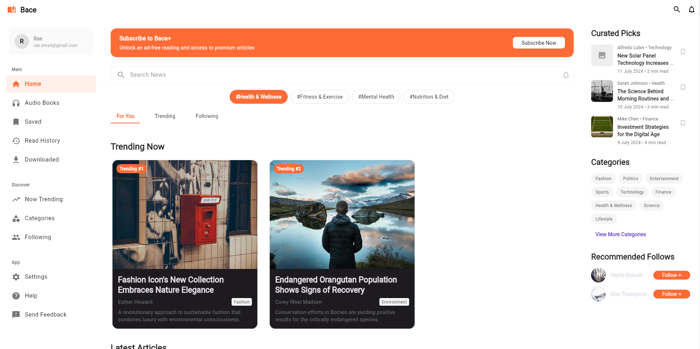

# Responsive Breakpoint  

A powerful and intuitive Flutter package for creating responsive layouts with ease. Build beautiful, adaptive UIs that work seamlessly across all screen sizes.

[](https://pub.dev/packages/responsive_breakpoint)
[](https://opensource.org/licenses/MIT)

## Example App

<div align="center">
  <table>
    <tr>
      <td align="center">
        
        <br><strong>Portrait Mode</strong>
      </td>
      <td align="center">
        
        <br><strong>Square Mode</strong>
      </td>
    </tr>
    <tr>
      <td align="center" colspan="2">
        
        <br><strong>Landscape Mode</strong>
      </td>
    </tr>
  </table>
</div>

*The example app demonstrates responsive layouts across different screen orientations using the responsive_breakpoint library.*

## Features

-  **Simple Breakpoint System**: 6 predefined breakpoints (xs, sm, md, lg, xl, xxl)
-  **Responsive Values**: Easily define different values for different screen sizes
-  **Adaptive Widgets**: Built-in responsive widgets for common use cases

## Breakpoints

| Breakpoint | Width Range | Device Type |
|------------|-------------|-------------|
| `xs` | < 600px | Mobile |
| `sm` | 600px - 959px | Large Mobile / Small Tablet |
| `md` | 960px - 1279px | Tablet |
| `lg` | 1280px - 1919px | Desktop |
| `xl` | 1920px - 2559px | Large Desktop |
| `xxl` | ≥ 2560px | Ultra-wide Desktop |

### Core Classes

- `ResponsiveValue<T>` - Define responsive values for different breakpoints
- `Breakpoint` - Enum for screen size breakpoints
- `Breakpoint.getBreakpoint(BuildContext)` - Get current breakpoint

### Widgets

- `ResponsiveFlex` - Responsive grid layout
- `ResponsiveVisibility` - Show/hide widgets based on screen size
- `ResponsiveBuilder<T>` - Build widgets conditionally
- `ResponsivePadding` - Adaptive padding
- `ResponsiveAxis` - Switch between Row and Column
- `ResponsivePreferredSizeBuilder<T>` - Responsive app bars
- `ResponsiveChild` - Conditional child widgets

### Extensions

- `BuildContext.responsive<T>(ResponsiveValue<T?> value)` - Extension method for responsive values

#### Example:

```dart
Widget build(BuildContext context) {
  final text = context.responsive(ResponsiveValue<String>(
    xs: 'Mobile text',
    sm: 'Tablet text',
    md: 'Desktop text',
    lg: 'Large desktop text',
  ));
  
  return Text(text ?? 'Default text');
}
```

## Installation

Add this to your package's `pubspec.yaml` file:

```yaml
dependencies:
	responsive_breakpoint: ^1.0.0
```

Then run:

```bash
flutter  pub  get
```

## Usage

### Basic Responsive Values

```dart
import  'package:responsive_breakpoint/responsive_breakpoint.dart';

// Define responsive values
final columns =  ResponsiveValue<int>(
  xs:  1,
  sm:  2,
  md:  3,
  lg:  4,
  xl:  5,
  xxl:  6,
);

// Use in your widget
Widget  build(BuildContext context) {
  final currentColumns = columns.of(context) ??  1;

  return  GridView.builder(
    gridDelegate:  SliverGridDelegateWithFixedCrossAxisCount(
      crossAxisCount: currentColumns,
    ),
  // ... rest of your grid
  );
}
```

### Extension Method

```dart
Widget  build(BuildContext context) {
	final text = context.responsive(
		ResponsiveValue<String>(
			xs:  'Mobile text',
			sm:  'Tablet text',
			md:  'Desktop text',
			lg:  'Large desktop text',
		),
	);

	return  Text(text ??  'Default text');
}
```

### Responsive Widgets

#### ResponsiveFlex

Create responsive grid layouts:

```dart
ResponsiveFlex(
	columns:  ResponsiveValue<int>(
		xs:  1,
		sm:  2,
		md:  3,
		lg:  4,
	),
	spacing:  16,
	runSpacing:  16,
	children: [
		Card(child:  Text('Item 1')),
		Card(child:  Text('Item 2')),
		Card(child:  Text('Item 3')),
		// ... more items
	],
);

```
#### ResponsiveVisibility

Show/hide widgets based on screen size:

```dart
ResponsiveVisibility(
	visible:  ResponsiveValue<bool>(
		xs:  false, // Hidden on mobile
		sm:  false, // Hidden on small tablets
		md:  true, // Visible on tablets and larger
	),
	child:  Sidebar(),
)
```

#### ResponsiveBuilder

Build widgets conditionally:

```dart
ResponsiveBuilder<String>(
	value:  ResponsiveValue<String>(
		xs:  'mobile',
		sm:  'tablet',
		md:  'desktop',
	),
	builder: (context, value) {
		switch (value) {
			case  'mobile':
				return  MobileLayout();
			case  'tablet':
				return  TabletLayout();
			case  'desktop':
				return  DesktopLayout();
			default:
				return  DefaultLayout();
		}
	},
)
```

#### ResponsivePadding

Adaptive padding:

```dart
ResponsivePadding(
	padding:  ResponsiveValue<EdgeInsets>(
		xs:  EdgeInsets.all(8),
		sm:  EdgeInsets.all(16),
		md:  EdgeInsets.all(24),
		lg:  EdgeInsets.all(32),
	),
	child:  YourWidget(),
);
```

#### ResponsiveAxis

Switch between Row and Column:

```dart
ResponsiveAxis(
	axis:  ResponsiveValue<Axis>(
		xs:  Axis.vertical, // Stack vertically on mobile
		md:  Axis.horizontal, // Side by side on larger screens
	),
	children: [
		Widget1(),
		Widget2(),
	],
);
```

#### ResponsivePreferredSizeBuilder

Responsive app bars:

```dart
ResponsivePreferredSizeBuilder<bool>(
	value:  ResponsiveValue<bool>(
		xs:  true, // Show leading on mobile
		md:  false, // Hide on larger screens
	),
	builder: (context, showLeading) {
		return  AppBar(
			automaticallyImplyLeading: showLeading,
			title:  Text('My App'),
		);
	},
);
```

#### ResponsiveChild

Conditional child widgets:

```dart
ResponsiveChild(
	child:  ResponsiveValue<Widget>(
		xs:  MobileWidget(),
		md:  DesktopWidget(),
	),
);
```

## Complete Example

```dart
import 'package:flutter/material.dart';
import 'package:responsive_breakpoint/responsive_breakpoint.dart';

class ResponsiveHomePage extends StatelessWidget {
  @override
  Widget build(BuildContext context) {
    return Scaffold(
      appBar: ResponsivePreferredSizeBuilder<bool>(
        value: ResponsiveValue<bool>(
          xs: true,
          md: false,
        ),
        builder: (context, showLeading) {
          return AppBar(
            automaticallyImplyLeading: showLeading,
            title: Text('Responsive App'),
          );
        },
      ),
      drawer: ResponsiveVisibility(
        visible: ResponsiveValue<bool>(
          xs: true,
          md: false,
        ),
        child: Drawer(child: DrawerContent()),
      ),
      body: Row(
        children: [
          // Sidebar - hidden on mobile
          ResponsiveVisibility(
            visible: ResponsiveValue<bool>(
              xs: false,
              md: true,
            ),
            child: Sidebar(),
          ),
          
          // Main content
          Expanded(
            child: Padding(
              padding: ResponsiveValue<EdgeInsets>(
                xs: EdgeInsets.all(16),
                sm: EdgeInsets.all(24),
                md: EdgeInsets.all(32),
              ).of(context) ?? EdgeInsets.all(16),
              child: ResponsiveFlex(
                columns: ResponsiveValue<int>(
                  xs: 1,
                  sm: 2,
                  md: 3,
                  lg: 4,
                ),
                spacing: 16,
                runSpacing: 16,
                children: List.generate(8, (index) => Card(
                  child: ListTile(
                    title: Text('Item $index'),
                  ),
                )),
              ),
            ),
          ),
        ],
      ),
    );
  }
}
```

### Custom Breakpoint Detection

```dart
// Get current breakpoint
Breakpoint current = Breakpoint.getBreakpoint(context);

// Check specific breakpoint
if (current == Breakpoint.xs) {
  // Mobile specific logic
}
```

### Responsive Values with Fallbacks

```dart
final value = ResponsiveValue<int>(
  xs: 1,
  lg: 4,
  // sm, md, xl, xxl will fallback to the nearest defined value
);

// On sm screens, this will return 1 (fallback to xs)
// On md screens, this will return 1 (fallback to xs)
// On lg screens, this will return 4
// On xl screens, this will return 4 (fallback to lg)
// On xxl screens, this will return 4 (fallback to lg)
```

## Example App

Check out the complete example app in the `example/` directory to see all features in action:

```bash
cd example
flutter run
```

## Contributions

Contributions are welcome! If you want to contribute to this project, please follow these steps:

1. **Fork this repository.**
2. **Create a new branch for your modification.**
3. **Make your changes and submit a pull request.**

## License
This project is licensed under the MIT License. See the [LICENSE](LICENSE) file for details.
